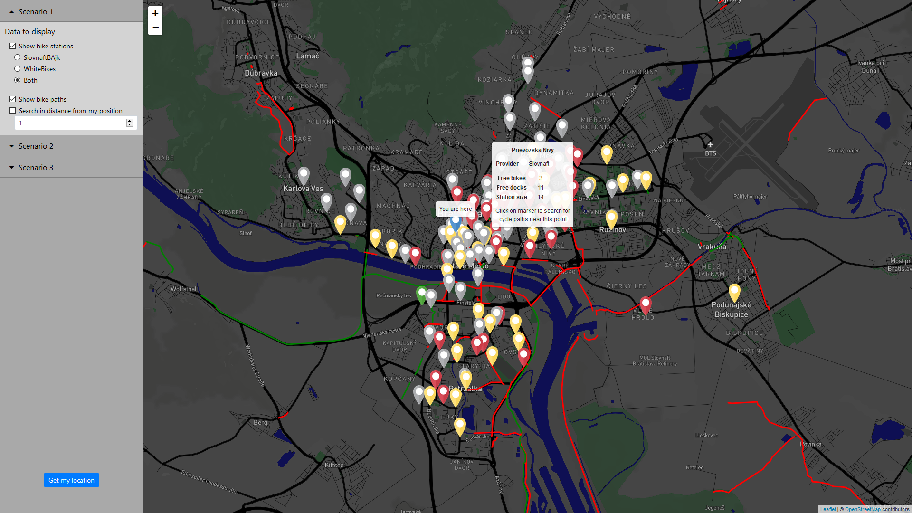
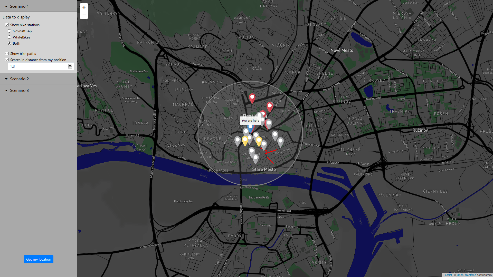
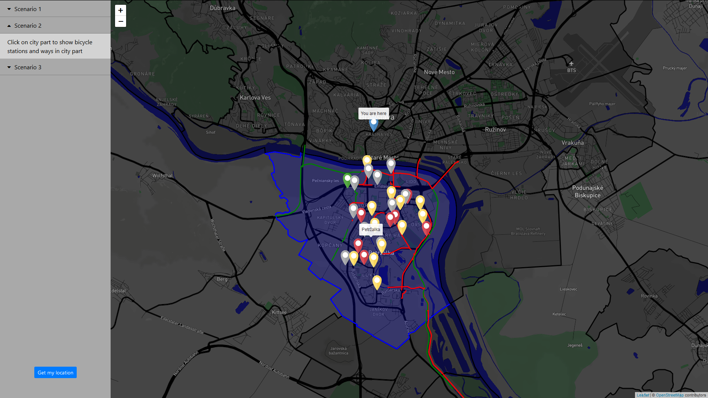
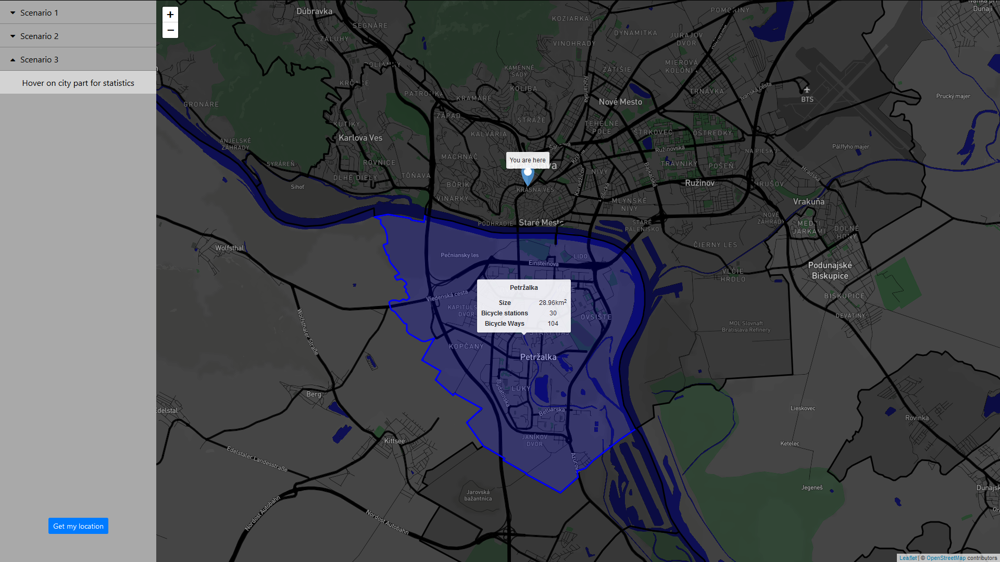

# Overview

*Vypracoval: Martin Nagy*

Aplikácia slúži na zobrazenie staníc s bicyklami bikesharingu spolu s napojením na jedného z poskytovateľov (SlovnaftBAjk) a cyklotrás v Bratislave, ako možnosť jednoduchého, rýchleho a lacného transportu po meste. Aplikácia umožňuje používateľovi nasledujúce:

- Nastavenie / získanie vlastnej polohy
- Zobrazenie všetkých staníc bicyklov spolu s informáciou o ich obsadenosti
- Zobrazenie cyklotrás spolu s informáciou, či sú určené iba pre bicykle
- Filtrovanie staníc bicyklov
    - Na základe poskytovateľa (SlovnaftBAjk / WhiteBikes)
    - Na základe polohy vzhľadom k používateľovej polohe
- Filtrovanie cyklotrás
    - Na základe polohy pri staniciach bicyklov
    - Na základe polohy vzhľadom k používateľovej polohe
- Zobrazenie staníc bicyklov a cyklotrás nachádzajúcich sa vo zvolenej mestskej časti
- Zobrazenie štatistiky počtu staníc bicyklov a cyklotrás vo zvolenej mestskej časti

Zobrazenie všetkých staníc bicyklov spolu s cyklotrasami a informáciami o obsadenosti stanice. Červené stanice sú prázdne / takmer prázdne, žlté sú naplnené z polovice a zelené plné / takmer plné. Zelené cyklotrasy sú určené iba pre bicykle, červené aj pre in prostriedky (cyklotrasy popri cestách)



Zobrazenie cyklotrás a staníc bicyklov v zadanej vzdialenosti od používateľovej polohy



Zobrazenie staníc bicyklov a cyklotrás v Petržalke



Zobrazenie štatistiky staníc bicyklov a cyklotrás v Petržalke v porovnaní s rozlohou



Aplikácia je rozdelená na 2 hlavné časti: [frontend](#frontend) vytvorený pomocou frameworku React s nadstavbou Redux a [backend](#backend) vytvorený v ASP .NET Core, písaný v jazyku C#. Pre uloženie dát bola použitá databáza PostgreSQL s rozšírením PostGIS. Komunikácia medzi frontend a backend časťou aplikácie prebieha pomocou [REST API](#api).

# Frontend

Frontend aplikácie je vytvorený pomocou frameworku React s nadstavbou Redux, spravujúcou dáta prijímané z API. Jedná sa o SPA obsahujúcu jednoduché menu v ľavej časti a mapu vo väčšej časti obrazovky. 

Mapa je vytvorená pomocou knižnice Leaflet.js a jej nadstavby react-leaflet pre jednoduchšie použitie vo frameworku React. Knižnica Leaflet.js sa taktiež stará o zobrazenie GeoJSON dát na mape a následnú interakciu s nimi.

Štýl mapy je vytvorený pomocou [Mapbox](https://www.mapbox.com/) editora, upravením Dark štýlu, ktorý je poskytovaný nástrojom. Štýl je ladený podobne ako aplikácia do tmavej farby so zvýraznením ciest a jemným zvýraznením zelených plôch aby používateľ mohol jednoznačne vidieť zobrazené cyklotrasy a stanice bicyklov.

Hlavná časť aplikácie sa nachádza v `App.js`. Medzi hlavné úlohy aplikácie patrí:

- Získanie polohy používateľa (prípadne jej nastavenie samotným používateľom)
- Spracovanie akcií používateľa a ich transformácia na REST volania API pomocou natívnej funkcie `fetch`
- Zobrazenie dát vo formáte GeoJSON v interaktívnej forme na mape

# Backend

Backend aplikácie jepísaný v jazyku C#, vo frameworku ASP.NET Core. Pre jednoduchšiu komunikáciu s databázou bol použitý EntityFramework s nadstavbou NetTopologySuite, ktorý umožňuje prácu s priestorovými dátami. Napriek tomu však bolo nutné niektoré transformačné funkcie (napríklad `ST_TRANSFORM`) písať pomocou čistého SQL kódu. GeoJSON formát je vytváraný z objektov typu Feature ktoré sú následne pomocou GeoJSON.NET nuget prekladané do GeoJSON. Pre vytváranie dopytov na databázu bol využitý integrovaný dopytový jazyk LINQ, ktorý bol pri vytváraní požiadaviek prekladaný do SQL.

## Data

Dáta boli stiahnuté z Open Street Maps. Pokrývajú oblasť Bratislavy nakoľko som sa zameral na dopravu v meste. Do databázy boli dáta importované pomocou nástroja `osm2pgsql`. V tabuľkách boli následne vytvorené indexy, ktoré pokrývajú najčastejšie používané kombinácie stĺpcov.

Pre planet_osm_point (body) to je kombinácia stĺpcov `operator` (prevádzkovateľ) a `amenity` (stanica bicykla) a stĺpec `way` označujúci samotný bod.

Pre planet_osm_line (cesty) to sú stĺpce `highway` označujúci typ cesty a `way` označujúci samotnú cestu.

Pre planet_osm_point (oblasti) to je kombinácia stĺpcov `admin_level` (úroveň) a `boundary` (typ oblasti) a stĺpec `way` označujúci samotnú oblasť.

Všetky dáta poskytované ako výstup prostredníctvom API sú vo formáte GeoJSON.

## Api

V nasledujúcich častiach sa nachádza prehľad endpointov v API, príklady vytvárania dopytov do databázy a príklady odpovede API na požiadavku.

### Request

**Zobrazenie staníc bicyklov s filtrovaním**

`GET /GetStations?lat=48.148598&lon=17.107748&slovnaftBAjk=false&whiteBikes=false&distance=1`

**Zobrazenie cyklotrás s filtrovaním**

`GET /GetCycleWays?lat=48.148598&lon=17.107748&distance=1`

**Zobrazenie cyklotrás v blízkosti konkrétnej stanice bicyklov**

`GET /GetNearbyCycleWays?stationId=19538`

**Zobrazenie častí mesta pre ďalšiu interakciu**

`GET /GetAdministrativeBorders`

**Zobrazenie cyklotrás a staníc bicyklov v konkrétnej časti mesta**

`GET /GetStationsAndWaysInsideArea?areaId=15820`

**Zobrazenie štatistík pre všetky časti mesta**

`GET /GetStatisticsForAreas`

### EntityFramework dopyt na databázu

V dopyte možno vidieť nutnosť využitia čistého SQL pre transformovanie bodu do správnej sústavy.

```c#
_db.PlanetOsmPoint
    .FromSql("SELECT id, ST_TRANSFORM(way, 4326) as way_computed, way, amenity, operator, name, ref from planet_osm_point")
    .Where(
        point => (point.Way.Distance(position) <= range * 1000 || range <= -1) &&
                 point.Amenity == "bicycle_rental" && 
                 (point.Operator == "Slovnaft" || !slovnaftBAjk) &&
                 (point.Operator == "WhiteBikes" || !whiteBikes) &&
                 point.Operator != null &&
                 point.Name != null
    )
    .Select(
        point => new Feature
        (
            new GeoJSON.Net.Geometry.Point
            (
                new Position
                (
                    point.WayComputed.Y, 
                    point.WayComputed.X,
                    null
                )
            ),
            new Dictionary<string, dynamic>
            {
                {"Id", point.Id},
                {"Name", point.Name},
                {"StationId", Convert.ToInt32(point.Ref)},
                {"Type", point.Operator == "Slovnaft" ? 0 : 1}
            },
            null
        )
    )
    .ToList();
```

### SQL dopyt

Vyššie uvedený príklad LINQ dopytu prevedený do SQL

```sql
SELECT 
  ST_Y(point.way_computed),
  ST_X(point.way_computed),
  point.id, 
  point.name, 
  CAST(point.ref AS integer),
  CASE
    WHEN point.operator = 'Slovnaft'
      THEN 0 
    ELSE 1
  END
FROM (
  SELECT 
    id, 
    ST_TRANSFORM(way, 4326) as way_computed, 
    way, 
    amenity, 
    operator, 
    name, 
    ref 
  FROM planet_osm_point
) AS point
WHERE (
  (
    (ST_Distance(point.way, @__position_1) <= (@__range_2 * 1000)) AND
    (point.amenity = 'bicycle_rental')
  ) AND 
  point.operator IS NOT NULL) AND 
  point.name IS NOT NULL
```

### Response

Príklad odpovede API vo formáte GeoJSON

```json
{
    "type":"Feature",
    "geometry":{
        "type":"Point",
        "coordinates":[
            17.1077531,
            48.106358499912204
        ]
    },
    "properties":{
        "Id":7417,
        "Name":"Sintavska / Jantarova cesta",
        "Size":14,
        "Ready":3,
        "Type":0
    }
}
```
